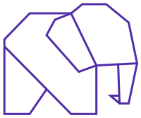

<p align="center">
  
</p>

<p align="center">
  <a href="https://github.com/phel-lang/phel-lang/actions">
    
  </a>
  <a href="https://scrutinizer-ci.com/g/phel-lang/phel-lang/?branch=main">
    
  </a>
  <a href="https://scrutinizer-ci.com/g/phel-lang/phel-lang/?branch=main">
    
  </a>
  <a href="https://shepherd.dev/github/phel-lang/phel-lang">
    
  </a>
  <a href="https://deepwiki.com/phel-lang/phel-lang">
    
  </a>
</p>


---

Functional, Lisp-inspired language that compiles to PHP. Macros, persistent data structures, and expressive functional idioms for the PHP ecosystem.

#### Example
<!--
using "clojure" here is just for the md coloring
we should use "phel" once GitHub accept phel coloring too
-->
```clojure
(ns my\example)

(defn greet [name] (str "Hello, " name "!"))

(println (greet "Phel"))
;; => Hello, Phel!
```

<details>
<summary><b>More examples →</b></summary>

<table>
<tr>
<td width="50%" valign="top">

**Data pipeline**

```clojure
(def users
  [{:name "Ada" :age 36}
   {:name "Bob" :age 17}
   {:name "Cam" :age 41}])

(->> users
     (filter #(>= (:age %) 18))
     (map :name)
     sort)
;; => ["Ada" "Cam"]
```

</td>
<td width="50%" valign="top">

**HTTP response**

```clojure
(ns app (:require phel\http :as h))

(def req (h/request-from-globals))

(h/emit-response
  (h/response-from-map
    {:status 200
     :headers {"Content-Type" "text/plain"}
     :body (str "Hello " (:uri req))}))
```

</td>
</tr>
<tr>
<td valign="top">

**Macros**

```clojure
(defmacro unless [pred & body]
  `(if (not ,pred)
     (do ,@body)))

(unless (zero? 1)
  (println "not zero"))
;; => not zero

(unless false (println "ok"))
;; => ok
```

</td>
<td valign="top">

**PHP interop**

```clojure
(ns app)

(def now (php/new \DateTime))
(.format now "Y-m-d")
;; => "2026-04-20"

(def epoch (php/new \DateTime "1970-01-01"))
(.-days (.diff now epoch))
;; => 20564
```

</td>
</tr>
</table>
</details>

## Getting Started

Install and scaffold in under a minute:

```sh
composer require phel-lang/phel-lang
./vendor/bin/phel init
```

Creates `phel-config.php`, `src/phel/main.phel`, `tests/phel/main_test.phel`. Then:

```sh
./vendor/bin/phel run src/phel/main.phel   # run
./vendor/bin/phel test                     # tests
./vendor/bin/phel repl                     # interactive
./vendor/bin/phel build                    # compile to PHP for production
```

Inline snippets or shell pipelines via `phel eval`:

```sh
./vendor/bin/phel eval '(+ 1 2)'           # prints 3
echo '(println "hi")' | ./vendor/bin/phel eval -
./vendor/bin/phel eval - < script.phel
```

Single-file scratch layout: `./vendor/bin/phel init --minimal` (no subdirectories).

## Documentation

**Start here**
- [Quick Start](docs/quickstart.md) — 5-minute tutorial
- [Installation](https://phel-lang.org/documentation/getting-started/) — full setup guide
- [phel-lang.org](https://phel-lang.org) — tutorials, exercises, blog

**Guides**
- [Clojure Migration](docs/clojure-migration.md) — differences, interop cheat sheet
- [Common Patterns](docs/patterns.md) — everyday idioms
- [PHP/Phel Interop](docs/php-interop.md)
- [Reader Shortcuts](docs/reader-shortcuts.md) · [Reader Conditionals](docs/reader-conditionals.md)
- [Transducers](docs/transducers.md) · [Data Structures](docs/data-structures-guide.md) · [Lazy Sequences](docs/lazy-sequences.md)
- [Mocking](docs/mocking-guide.md) · [Examples](docs/examples/README.md) · [Performance](docs/performance.md)

**Reference**
- [Compiler Internals](docs/internals/compiler.md)
- [Repository Guidelines](AGENTS.md)
- [Packagist](https://packagist.org/packages/phel-lang/phel-lang)

**AI coding agents**
- [.agents/](.agents/README.md) — Claude Code, Cursor, Codex, Gemini, Copilot, Aider
- `./vendor/bin/phel agent-install [platform] [--all]` — install skill file for your agent

## Build PHAR

```sh
./build/phar.sh
```

Produces `build/out/phel.phar`.

## Contribute

New here? Start with [CONTRIBUTING.md](.github/CONTRIBUTING.md) — setup, workflow, "Where to Start". See [AGENTS.md](AGENTS.md) for architecture and review expectations.
