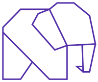

<p align="center">
  
</p>

<p align="center">
  <a href="https://github.com/phel-lang/phel-lang/actions/workflows/tests.yml">
    
  </a>
  <a href="https://github.com/phel-lang/phel-lang/actions/workflows/quality.yml">
    
  </a>
  <a href="https://github.com/phel-lang/phel-lang/blob/main/phpstan.neon">
    
  </a>
  <a href="https://github.com/phel-lang/phel-lang/blob/main/psalm.xml">
    
  </a>
  <a href="https://shepherd.dev/github/phel-lang/phel-lang">
    
  </a>
</p>

<p align="center">
  <a href="https://packagist.org/packages/phel-lang/phel-lang">
    
  </a>
  <a href="https://packagist.org/packages/phel-lang/phel-lang/stats">
    
  </a>
  <a href="https://packagist.org/packages/phel-lang/phel-lang">
    
  </a>
  <a href="https://github.com/phel-lang/phel-lang/blob/main/LICENSE">
    
  </a>
  <a href="https://deepwiki.com/phel-lang/phel-lang">
    
  </a>
</p>

---

Lisp for PHP, macros, persistent data structures, REPL.

## Requirements

PHP **8.5** or newer. Linux and macOS are supported: the full compiler, core and PHAR
suites run on both in CI, and a failure on either blocks a release. Windows is best
effort, running a reduced suite. What a version number promises, and for how long, is
in the [stability policy](docs/stability.md).

## Get Started

```sh
composer require phel-lang/phel-lang
```

**1. Open a REPL**

```sh
./vendor/bin/phel repl
```

```clojure
user:1> (->> [1 2 3 4 5] (filter odd?) (map #(* % %)) (reduce +))
35
user:2> (defn greet [who] (str "Hello, " who "!"))
#'user/greet
user:3> (greet "Phel")
"Hello, Phel!"
```

**2. Scaffold a project**

```sh
./vendor/bin/phel init         # add `--minimal` for a single-file layout
```

Creates `phel-config.php`, `src/main.phel`, `tests/main_test.phel`. With
`--minimal` the two sources sit at the project root instead. Then:

```sh
./vendor/bin/phel run src/main.phel        # run
./vendor/bin/phel test                     # tests
./vendor/bin/phel build                    # compile to PHP
./vendor/bin/phel config                   # inspect the merged config
```

**3. Eval inline or via stdin**

```sh
./vendor/bin/phel eval '(+ 1 2)'           # prints 3
echo '(println "hi")' | ./vendor/bin/phel eval -
./vendor/bin/phel eval - < script.phel
```

**4. Enable shell completion (optional)**

`./vendor/bin/phel completion` dumps a tab-completion script for `bash`, `zsh`, or `fish`. It completes commands, their options, and dynamic values (function names for `doc`, project namespaces for `run`/`test`).

```sh
# bash — restart your shell afterwards
./vendor/bin/phel completion bash | sudo tee /etc/bash_completion.d/phel

# zsh — write into a directory on your $fpath
./vendor/bin/phel completion zsh > "${fpath[1]}/_phel"

# fish
./vendor/bin/phel completion fish > ~/.config/fish/completions/phel.fish
```

The zsh script starts with `#compdef phel`, so completion only triggers for a binary named `phel` on your `$PATH`. If you call `./vendor/bin/phel` (or `./bin/phel` in a dev checkout), symlink a global `phel` first, e.g. on macOS + Homebrew:

```sh
phel completion zsh > "$(brew --prefix)/share/zsh/site-functions/_phel"
ln -sf "$PWD/bin/phel" "$(brew --prefix)/bin/phel"   # global `phel` so #compdef matches
rm -f ~/.zcompdump*                                  # force compinit to rebuild
# then open a new shell
```

> Prefer a project template? [`web-skeleton`](https://github.com/phel-lang/web-skeleton) or [`cli-skeleton`](https://github.com/phel-lang/cli-skeleton): click **Use this template** for a one-click start.

<details>
<summary><b>More examples →</b></summary>

<table>
<tr>
<td width="50%" valign="top">

**Data pipeline**

```clojure
(def users
  [{:name "Ada" :age 36}
   {:name "Bob" :age 17}
   {:name "Cam" :age 41}])

(->> users
     (filter #(>= (:age %) 18))
     (map :name)
     sort)
;; => ["Ada" "Cam"]
```

</td>
<td width="50%" valign="top">

**HTTP response**

```clojure
(ns app (:require phel.http :as h))

(def req (h/request-from-globals))

(h/emit-response
  (h/response-from-map
    {:status 200
     :headers {"Content-Type" "text/plain"}
     :body (str "Hello " (:uri req))}))
```

</td>
</tr>
<tr>
<td valign="top">

**Macros**

```clojure
(defmacro unless [pred & body]
  `(if (not ~pred)
     (do ~@body)))

(unless (zero? 1)
  (println "not zero"))
;; => not zero

(unless false (println "ok"))
;; => ok
```

</td>
<td valign="top">

**PHP interop**

```clojure
(ns app)

(def now (new DateTime))
(.format now "Y-m-d")
;; => "2026-04-20"

(def epoch (new DateTime "1970-01-01"))
(.-days (.diff now epoch))
;; => 20564
```

</td>
</tr>
</table>
</details>

## Standalone PHAR

Each [release](https://github.com/phel-lang/phel-lang/releases) attaches `phel.phar`, a single file you can run without Composer. Check it against the sha256 digest GitHub shows for the asset before you run it. The PHAR carries its own hash, but anyone who rebuilds it can recompute that.

```sh
tag=v1.0.0    # the release you want
gh release download "$tag" --repo phel-lang/phel-lang --pattern phel.phar
expected=$(gh release view "$tag" --repo phel-lang/phel-lang --json assets \
  --jq '.assets[] | select(.name == "phel.phar") | .digest | ltrimstr("sha256:")')
echo "$expected  phel.phar" | shasum -a 256 -c -    # macOS and Linux
echo "$expected  phel.phar" | sha256sum -c -        # Linux, if shasum is missing
```

`phel.phar: OK` means the file matches. Anything else, delete the file and do not run it. Without `gh`, copy the digest from the asset list on the release page and use `shasum -a 256 phel.phar` or `sha256sum phel.phar`.

Release tags are GPG-signed. In a clone, run `git tag -v "$tag"` with the maintainer's public key imported.

## Documentation

- [Getting Started](https://phel-lang.org/documentation/getting-started/): install, REPL, first script (5 min)
- [CLI Reference & DX Guide](docs/cli-reference.md): every command, the dev loop, compile vs eval vs run vs build
- [phel-lang.org](https://phel-lang.org/documentation/): full documentation, tutorials, exercises, blog
- [Contributor docs](docs/README.md): repository internals, architecture, project layout
- [Architecture decisions](docs/adr/README.md): why the repository is shaped the way it is
- [Packagist](https://packagist.org/packages/phel-lang/phel-lang)
- [CONTRIBUTING.md](.github/CONTRIBUTING.md): setup and workflow

## AI Coding Agents

Skill files for Claude Code, Cursor, Codex, Gemini, Copilot, Aider: [resources/agents/](resources/agents/README.md)

```sh
./vendor/bin/phel agent-install [platform]   # install skill file for one agent (claude, cursor, ...)
./vendor/bin/phel agent-install --auto       # only agents detected in this project
./vendor/bin/phel agent-install --all        # every supported platform
```
